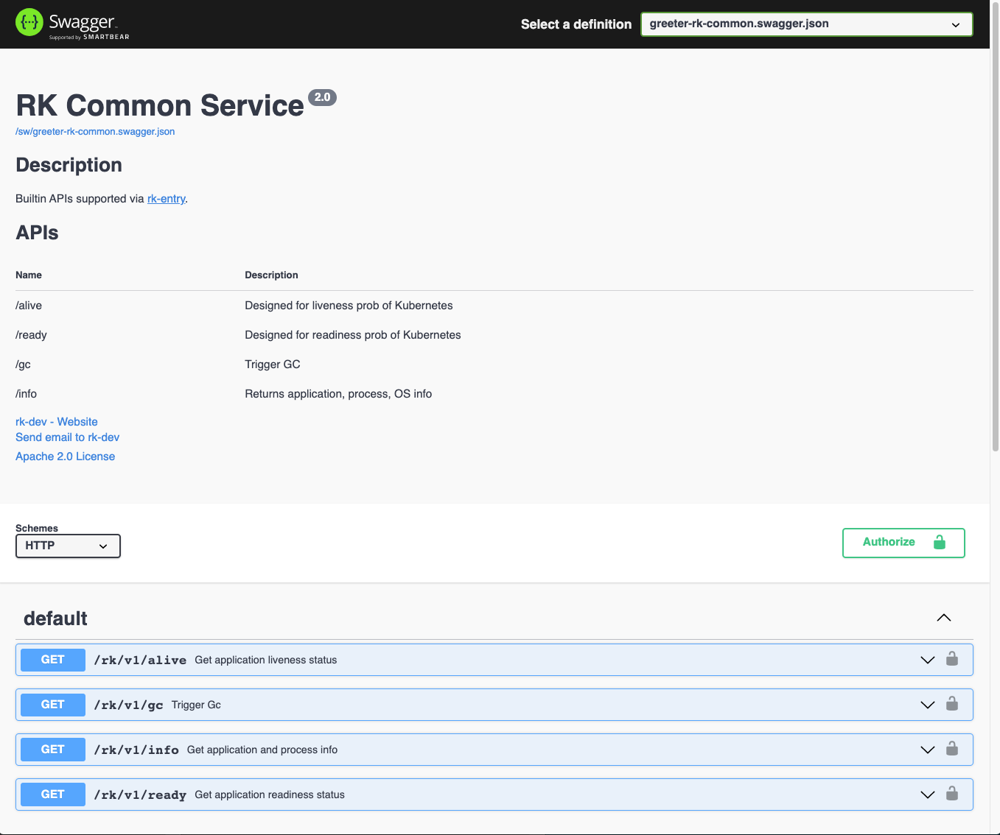

# rk-gf
[](https://github.com/rookie-ninja/rk-gf/actions/workflows/ci.yml)
[](https://goreportcard.com/report/github.com/rookie-ninja/rk-gf)
[](https://codecov.io/gh/rookie-ninja/rk-gf)
[](https://opensource.org/licenses/Apache-2.0)

Interceptor & bootstrapper designed for [gogf/gf](https://github.com/gogf/gf) web framework. [Documentation](https://docs.rkdev.info/docs/rk-boot/getting-started/gf/).

This belongs to [rk-boot](https://github.com/rookie-ninja/rk-boot) family. We suggest use this lib from [rk-boot](https://github.com/rookie-ninja/rk-boot).


## Architecture


## Supported bootstrap
| Bootstrap  | Description                                                        |
|------------|--------------------------------------------------------------------|
| YAML based | Start [gogf/gf](https://github.com/gogf/gf) microservice from YAML |
| Code based | Start [gogf/gf](https://github.com/gogf/gf) microservice from code |

## Supported instances
All instances could be configured via YAML or Code.

**User can enable anyone of those as needed! No mandatory binding!**

| Instance          | Description                                                                                                   |
|-------------------|---------------------------------------------------------------------------------------------------------------|
| ghttp.Server      | Compatible with original [gogf/gf](https://github.com/gogf/gf) service functionalities                        |
| Config            | Configure [spf13/viper](https://github.com/spf13/viper) as config instance and reference it from YAML         |
| Logger            | Configure [uber-go/zap](https://github.com/uber-go/zap) logger configuration and reference it from YAML       |
| Event             | Configure logging of RPC with [rk-query](https://github.com/rookie-ninja/rk-query) and reference it from YAML |
| Cert              | Fetch TLS/SSL certificates start microservice.                                                                |
| Prometheus        | Start prometheus client at client side and push metrics to pushgateway as needed.                             |
| Swagger           | Builtin swagger UI handler.                                                                                   |
| Docs              | Builtin [RapiDoc](https://github.com/mrin9/RapiDoc) instance which can be used to replace swagger and RK TV.  |
| CommonService     | List of common APIs.                                                                                          |
| StaticFileHandler | A Web UI shows files could be downloaded from server, currently support source of local and embed.FS.         |
| PProf             | PProf web UI.                                                                                                 |

## Supported middlewares
All middlewares could be configured via YAML or Code.

**User can enable anyone of those as needed! No mandatory binding!**

| Middleware | Description                                                                                                                                           |
|------------|-------------------------------------------------------------------------------------------------------------------------------------------------------|
| Prom       | Collect RPC metrics and export to [prometheus](https://github.com/prometheus/client_golang) client.                                                   |
| Logging    | Log every RPC requests as event with [rk-query](https://github.com/rookie-ninja/rk-query).                                                            |
| Trace      | Collect RPC trace and export it to stdout, file or jaeger with [open-telemetry/opentelemetry-go](https://github.com/open-telemetry/opentelemetry-go). |
| Panic      | Recover from panic for RPC requests and log it.                                                                                                       |
| Meta       | Send micsro service metadata as header to client.                                                                                                     |
| Auth       | Support [Basic Auth] and [API Key] authorization types.                                                                                               |
| RateLimit  | Limiting RPC rate globally or per path.                                                                                                               |
| CORS       | Server side CORS validation.                                                                                                                          |
| JWT        | Server side JWT validation.                                                                                                                           |
| Secure     | Server side secure validation.                                                                                                                        |
| CSRF       | Server side csrf validation.                                                                                                                          |

## Installation
`go get github.com/rookie-ninja/rk-gf`

## Quick Start
In the bellow example, we will start microservice with bellow functionality and middlewares enabled via YAML.

- Http server with [gorilla/mux](https://github.com/gorilla/mux) router
- Swagger UI
- Docs
- CommonService
- Prometheus Metrics (middleware)
- Logging (middleware)
- Meta (middleware)

Please refer example at [example/boot/simple](example/boot/simple).

### 1.Create boot.yaml
- [boot.yaml](example/boot/simple/boot.yaml)

```yaml
---
gf:
  - name: greeter                     # Required
    port: 8080                        # Required
    enabled: true                     # Required
    commonService:                    # Optional
      enabled: true                   # Optional, default: false
    sw:                               # Optional
      enabled: true                   # Optional, default: false
    docs:                             # Optional
      enabled: true                   # Optional, default: false
    prom:
      enabled: true                   # Optional, default: false
    middleware:
      logging:
        enabled: true
      prom:
        enabled: true
      meta:
        enabled: true
```

### 2.Create main.go
- [main.go](example/boot/simple/main.go)

```go
// Copyright (c) 2021 rookie-ninja
//
// Use of this source code is governed by an Apache-style
// license that can be found in the LICENSE file.
package main

import (
	"context"
	"embed"
	_ "embed"
	"fmt"
	"github.com/gogf/gf/v2/net/ghttp"
	"github.com/rookie-ninja/rk-entry/v2/entry"
	"github.com/rookie-ninja/rk-gf/boot"
	"net/http"
)

// How to use embed.FS for:
//
// - boot.yaml
// - rkentry.DocsEntryType
// - rkentry.SWEntryType
// - rkentry.StaticFileHandlerEntryType
// - rkentry.CertEntry
//
// If we use embed.FS, then we only need one single binary file while packing.
// We suggest use embed.FS to pack swagger local file since rk-entry would use os.Getwd() to look for files
// if relative path was provided.
//
//go:embed docs
var docsFS embed.FS

func init() {
	rkentry.GlobalAppCtx.AddEmbedFS(rkentry.SWEntryType, "greeter", &docsFS)
}

//go:embed boot.yaml
var boot []byte

// @title RK Swagger for Mux
// @version 1.0
// @description This is a greeter service with rk-boot.
func main() {
	// Bootstrap preload entries
	rkentry.BootstrapPreloadEntryYAML(boot)

	// Bootstrap gin entry from boot config
	res := rkgf.RegisterGfEntryYAML(boot)

	// Get rkgf.GfEntry
	gfEntry := res["greeter"].(*rkgf.GfEntry)
	gfEntry.Server.BindHandler("/v1/greeter", Greeter)

	fmt.Println("I amhere")

	// Bootstrap gf entry
	gfEntry.Bootstrap(context.Background())

	// Wait for shutdown signal
	rkentry.GlobalAppCtx.WaitForShutdownSig()

	// Interrupt gf entry
	gfEntry.Interrupt(context.Background())
}

// Greeter handler
// @Summary Greeter service
// @Id 1
// @version 1.0
// @produce application/json
// @Param name query string true "Input name"
// @Success 200 {object} GreeterResponse
// @Router /v1/greeter [get]
func Greeter(ctx *ghttp.Request) {
	ctx.Response.WriteHeader(http.StatusOK)
	ctx.Response.WriteJson(&GreeterResponse{
		Message: fmt.Sprintf("Hello %s!", ctx.GetQuery("name").String()),
	})
}

type GreeterResponse struct {
	Message string
}
```

### 3.Start server

```go
$ go run main.go
```

### 4.Validation
#### 4.1 GoFrame server
Try to test GoFrame Service with [curl](https://curl.se/)

```shell script
# Curl to common service
$ curl localhost:8080/rk/v1/ready
{
  "ready": true
}

$ curl localhost:8080/rk/v1/alive
{
  "alive": true
}
```

#### 4.2 Swagger UI
Please refer **sw** section at [Full YAML](#full-yaml).

By default, we could access swagger UI at [http://localhost:8080/sw](http://localhost:8080/sw)



#### 4.3 Docs UI
Please refer **docs** section at [Full YAML](#full-yaml).

By default, we could access docs UI at [http://localhost:8080/docs](http://localhost:8080/docs)


#### 4.4 Prometheus Metrics
Please refer **middleware.prom** section at [Full YAML](#full-yaml).

By default, we could access prometheus client at [http://localhost:8080/metrics](http://localhost:8080/metrics)
- http://localhost:8080/metrics


#### 4.5 Logging
Please refer **middleware.logging** section at [Full YAML](#full-yaml).

By default, we enable zap logger and event logger with encoding type of [console]. Encoding type of [json] is also supported.

```shell script
2021-12-29T00:28:29.030+0800    INFO    boot/gf_entry.go:1050   Bootstrap gfEntry     {"eventId": "619d9c74-f484-4ca0-b600-e91c96e6ddd8", "entryName": "greeter"}
------------------------------------------------------------------------
endTime=2021-12-29T00:28:29.032702+08:00
startTime=2021-12-29T00:28:29.030675+08:00
elapsedNano=2027178
timezone=CST
ids={"eventId":"619d9c74-f484-4ca0-b600-e91c96e6ddd8"}
app={"appName":"rk","appVersion":"","entryName":"greeter","entryType":"GfEntry"}
env={"arch":"amd64","az":"*","domain":"*","hostname":"lark.local","localIP":"192.168.101.5","os":"darwin","realm":"*","region":"*"}
payloads={"commonServiceEnabled":true,"commonServicePathPrefix":"/rk/v1/","gfPort":8080,"promEnabled":true,"promPath":"/metrics","promPort":8080,"swEnabled":true,"swPath":"/sw/","tvEnabled":true,"tvPath":"/rk/v1/tv/"}
error={}
counters={}
pairs={}
timing={}
remoteAddr=localhost
operation=Bootstrap
resCode=OK
eventStatus=Ended
EOE
```

#### 4.6 Meta
Please refer **meta** section at [Full YAML](#full-yaml).

By default, we will send back some metadata to client including gateway with headers.

```shell script
$ curl -vs localhost:8080/rk/v1/healthy
...
< HTTP/1.1 200 OK
< Content-Type: application/json
< Server: GoFrame HTTP Server
< X-Request-Id: 9cc18bda-da7c-456b-acbe-0f07778a30cf
< X-Rk-App-Name: rk
< X-Rk-App-Unix-Time: 2021-12-29T00:59:39.262428+08:00
< X-Rk-App-Version: 
< X-Rk-Received-Time: 2021-12-29T00:59:39.262428+08:00
< Date: Tue, 28 Dec 2021 16:59:39 GMT
...
```

#### 4.7 Send request
We registered /v1/greeter API in [gogf/gf](https://github.com/gogf/gf) server and let's validate it!

```shell script
$ curl -vs "localhost:8080/v1/greeter?name=rk-dev"
*   Trying ::1...
* TCP_NODELAY set
* Connected to localhost (::1) port 8080 (#0)
> GET /v1/greeter HTTP/1.1
> Host: localhost:8080
> User-Agent: curl/7.64.1
> Accept: */*
> 
< HTTP/1.1 200 OK
< Content-Type: application/json
< Server: GoFrame HTTP Server
< X-Request-Id: 5f08faa2-c682-4738-ae95-7792ae5743b8
< X-Rk-App-Name: rk
< X-Rk-App-Unix-Time: 2021-12-29T01:00:18.521554+08:00
< X-Rk-App-Version: 
< X-Rk-Received-Time: 2021-12-29T01:00:18.521554+08:00
< Date: Tue, 28 Dec 2021 17:00:18 GMT
< Content-Length: 20
< 
* Connection #0 to host localhost left intact
{"Message":"Hello rk-dev!"}
```

#### 4.8 RPC logs
Bellow logs would be printed in stdout.

```
------------------------------------------------------------------------
endTime=2021-12-29T01:00:18.521684+08:00
startTime=2021-12-29T01:00:18.521544+08:00
elapsedNano=139743
timezone=CST
ids={"eventId":"5f08faa2-c682-4738-ae95-7792ae5743b8","requestId":"5f08faa2-c682-4738-ae95-7792ae5743b8"}
app={"appName":"rk","appVersion":"","entryName":"greeter","entryType":"GfEntry"}
env={"arch":"amd64","az":"*","domain":"*","hostname":"lark.local","localIP":"192.168.101.5","os":"darwin","realm":"*","region":"*"}
payloads={"apiMethod":"GET","apiPath":"/v1/greeter","apiProtocol":"HTTP/1.1","apiQuery":"","userAgent":"curl/7.64.1"}
error={}
counters={}
pairs={}
timing={}
remoteAddr=localhost:54594
operation=/v1/greeter
resCode=200
eventStatus=Ended
EOE
```

#### 4.9 RPC prometheus metrics
Prometheus client will automatically register into [gogf/gf](https://github.com/gogf/gf) instance at /metrics.

Access [http://localhost:8080/metrics](http://localhost:8080/metrics)


## YAML Options
User can start multiple [gogf/gf](https://github.com/gogf/gf) instances at the same time. Please make sure use different port and name.

### GoFrame
| name           | description                                                                                                        | type    | default value           |
|----------------|--------------------------------------------------------------------------------------------------------------------|---------|-------------------------|
| gf.name        | Required, The name of mux server                                                                                   | string  | N/A                     |
| gf.port        | Required, The port of mux server                                                                                   | integer | nil, server won't start |
| gf.enabled     | Optional, Enable mux entry or not                                                                                  | bool    | false                   |
| gf.description | Optional, Description of mux entry.                                                                                | string  | ""                      |
| gf.certEntry   | Optional, Reference of certEntry declared in [cert entry](https://github.com/rookie-ninja/rk-entry#certentry)      | string  | ""                      |
| gf.loggerEntry | Optional, Reference of loggerEntry declared in [LoggerEntry](https://github.com/rookie-ninja/rk-entry#loggerentry) | string  | ""                      |
| gf.eventEntry  | Optional, Reference of eventLEntry declared in [eventEntry](https://github.com/rookie-ninja/rk-entry#evententry)   | string  | ""                      |

### CommonService
| Path         | Description                       |
|--------------|-----------------------------------|
| /rk/v1/gc    | Trigger GC                        |
| /rk/v1/ready | Get application readiness status. |
| /rk/v1/alive | Get application aliveness status. |
| /rk/v1/info  | Get application and process info. |

| name                        | description                             | type    | default value |
|-----------------------------|-----------------------------------------|---------|---------------|
| gf.commonService.enabled    | Optional, Enable builtin common service | boolean | false         |
| gf.commonService.pathPrefix | Optional, Provide path prefix           | string  | /rk/v1        |

### Swagger
| name           | description                                                        | type     | default value |
|----------------|--------------------------------------------------------------------|----------|---------------|
| gf.sw.enabled  | Optional, Enable swagger service over gin server                   | boolean  | false         |
| gf.sw.path     | Optional, The path access swagger service from web                 | string   | /sw           |
| gf.sw.jsonPath | Optional, Where the swagger.json files are stored locally          | string   | ""            |
| gf.sw.headers  | Optional, Headers would be sent to caller as scheme of [key:value] | []string | []            |

### Docs (RapiDoc)
| name                | description                                                                            | type     | default value |
|---------------------|----------------------------------------------------------------------------------------|----------|---------------|
| gf.docs.enabled     | Optional, Enable RapiDoc service over gin server                                       | boolean  | false         |
| gf.docs.path        | Optional, The path access docs service from web                                        | string   | /docs         |
| gf.docs.jsonPath    | Optional, Where the swagger.json or open API files are stored locally                  | string   | ""            |
| gf.docs.headers     | Optional, Headers would be sent to caller as scheme of [key:value]                     | []string | []            |
| gf.docs.style.theme | Optional, light and dark are supported options                                         | string   | []            |
| gf.docs.debug       | Optional, Enable debugging mode in RapiDoc which can be used as the same as Swagger UI | boolean  | false         |

### Prom Client
| name                         | description                                                                        | type    | default value |
|------------------------------|------------------------------------------------------------------------------------|---------|---------------|
| gf.prom.enabled              | Optional, Enable prometheus                                                        | boolean | false         |
| gf.prom.path                 | Optional, Path of prometheus                                                       | string  | /metrics      |
| gf.prom.pusher.enabled       | Optional, Enable prometheus pusher                                                 | bool    | false         |
| gf.prom.pusher.jobName       | Optional, Job name would be attached as label while pushing to remote pushgateway  | string  | ""            |
| gf.prom.pusher.remoteAddress | Optional, PushGateWay address, could be form of http://x.x.x.x or x.x.x.x          | string  | ""            |
| gf.prom.pusher.intervalMs    | Optional, Push interval in milliseconds                                            | string  | 1000          |
| gf.prom.pusher.basicAuth     | Optional, Basic auth used to interact with remote pushgateway, form of [user:pass] | string  | ""            |
| gf.prom.pusher.certEntry     | Optional, Reference of rkentry.CertEntry                                           | string  | ""            |

### Static file handler
| name                 | description                                | type    | default value |
|----------------------|--------------------------------------------|---------|---------------|
| gf.static.enabled    | Optional, Enable static file handler       | boolean | false         |
| gf.static.path       | Optional, path of static file handler      | string  | /static       |
| gf.static.sourceType | Required, local and embed.FS are supported | string  | ""            |
| gf.static.sourcePath | Required, full path of source directory    | string  | ""            |

- About embed.FS
  User has to set embedFS before Bootstrap() function as bellow:
-
```go
//go:embed /*
var staticFS embed.FS

rkentry.GlobalAppCtx.AddEmbedFS(rkentry.StaticFileHandlerEntryType, "greeter", &staticFS)
```

### Middlewares
| name                 | description                                            | type     | default value |
|----------------------|--------------------------------------------------------|----------|---------------|
| gf.middleware.ignore | The paths of prefix that will be ignored by middleware | []string | []            |

#### Logging
| name                                    | description                                            | type     | default value |
|-----------------------------------------|--------------------------------------------------------|----------|---------------|
| gf.middleware.logging.enabled           | Enable log middleware                                  | boolean  | false         |
| gf.middleware.logging.ignore            | The paths of prefix that will be ignored by middleware | []string | []            |
| gf.middleware.logging.loggerEncoding    | json or console or flatten                             | string   | console       |
| gf.middleware.logging.loggerOutputPaths | Output paths                                           | []string | stdout        |
| gf.middleware.logging.eventEncoding     | json or console or flatten                             | string   | console       |
| gf.middleware.logging.eventOutputPaths  | Output paths                                           | []string | false         |

We will log two types of log for every RPC call.
- Logger

Contains user printed logging with requestId or traceId.

- Event

Contains per RPC metadata, response information, environment information and etc.

| Field       | Description                                                                                                                                                                                                                                                                                                           |
|-------------|-----------------------------------------------------------------------------------------------------------------------------------------------------------------------------------------------------------------------------------------------------------------------------------------------------------------------|
| endTime     | As name described                                                                                                                                                                                                                                                                                                     |
| startTime   | As name described                                                                                                                                                                                                                                                                                                     |
| elapsedNano | Elapsed time for RPC in nanoseconds                                                                                                                                                                                                                                                                                   |
| timezone    | As name described                                                                                                                                                                                                                                                                                                     |
| ids         | Contains three different ids(eventId, requestId and traceId). If meta interceptor was enabled or event.SetRequestId() was called by user, then requestId would be attached. eventId would be the same as requestId if meta interceptor was enabled. If trace interceptor was enabled, then traceId would be attached. |
| app         | Contains [appName, appVersion](https://github.com/rookie-ninja/rk-entry#appinfoentry), entryName, entryType.                                                                                                                                                                                                          |
| env         | Contains arch, az, domain, hostname, localIP, os, realm, region. realm, region, az, domain were retrieved from environment variable named as REALM, REGION, AZ and DOMAIN. "*" means empty environment variable.                                                                                                      |
| payloads    | Contains RPC related metadata                                                                                                                                                                                                                                                                                         |
| error       | Contains errors if occur                                                                                                                                                                                                                                                                                              |
| counters    | Set by calling event.SetCounter() by user.                                                                                                                                                                                                                                                                            |
| pairs       | Set by calling event.AddPair() by user.                                                                                                                                                                                                                                                                               |
| timing      | Set by calling event.StartTimer() and event.EndTimer() by user.                                                                                                                                                                                                                                                       |
| remoteAddr  | As name described                                                                                                                                                                                                                                                                                                     |
| operation   | RPC method name                                                                                                                                                                                                                                                                                                       |
| resCode     | Response code of RPC                                                                                                                                                                                                                                                                                                  |
| eventStatus | Ended or InProgress                                                                                                                                                                                                                                                                                                   |

- example

```shell script
------------------------------------------------------------------------
endTime=2021-11-01T23:31:01.706614+08:00
startTime=2021-11-01T23:31:01.706335+08:00
elapsedNano=278966
timezone=CST
ids={"eventId":"61cae46e-ea98-47b5-8a39-1090d015e09a","requestId":"61cae46e-ea98-47b5-8a39-1090d015e09a"}
app={"appName":"rk-gf","appVersion":"master-e4538d7","entryName":"greeter","entryType":"GfEntry"}
env={"arch":"amd64","az":"*","domain":"*","hostname":"lark.local","localIP":"192.168.1.104","os":"darwin","realm":"*","region":"*"}
payloads={"apiMethod":"GET","apiPath":"/rk/v1/healthy","apiProtocol":"HTTP/1.1","apiQuery":"","userAgent":"curl/7.64.1"}
error={}
counters={}
pairs={}
timing={}
remoteAddr=localhost:54376
operation=/rk/v1/healthy
resCode=200
eventStatus=Ended
EOE
```

#### Prometheus
| name                       | description                                            | type     | default value |
|----------------------------|--------------------------------------------------------|----------|---------------|
| gf.middleware.prom.enabled | Enable metrics middleware                              | boolean  | false         |
| gf.middleware.prom.ignore  | The paths of prefix that will be ignored by middleware | []string | []            |

#### Auth
Enable the server side auth. codes.Unauthenticated would be returned to client if not authorized with user defined credential.

| name                       | description                                            | type     | default value |
|----------------------------|--------------------------------------------------------|----------|---------------|
| gf.middleware.auth.enabled | Enable auth middleware                                 | boolean  | false         |
| gf.middleware.auth.ignore  | The paths of prefix that will be ignored by middleware | []string | []            |
| gf.middleware.auth.basic   | Basic auth credentials as scheme of <user:pass>        | []string | []            |
| gf.middleware.auth.apiKey  | API key auth                                           | []string | []            |

#### Meta
Send application metadata as header to client.

| name                       | description                                            | type     | default value |
|----------------------------|--------------------------------------------------------|----------|---------------|
| gf.middleware.meta.enabled | Enable meta middleware                                 | boolean  | false         |
| gf.middleware.meta.ignore  | The paths of prefix that will be ignored by middleware | []string | []            |
| gf.middleware.meta.prefix  | Header key was formed as X-<Prefix>-XXX                | string   | RK            |

#### Tracing
| name                                                   | description                                            | type     | default value                    |
|--------------------------------------------------------|--------------------------------------------------------|----------|----------------------------------|
| gf.middleware.trace.enabled                            | Enable tracing middleware                              | boolean  | false                            |
| gf.middleware.trace.ignore                             | The paths of prefix that will be ignored by middleware | []string | []                               |
| gf.middleware.trace.exporter.file.enabled              | Enable file exporter                                   | boolean  | false                            |
| gf.middleware.trace.exporter.file.outputPath           | Export tracing info to files                           | string   | stdout                           |
| gf.middleware.trace.exporter.jaeger.agent.enabled      | Export tracing info to jaeger agent                    | boolean  | false                            |
| gf.middleware.trace.exporter.jaeger.agent.host         | As name described                                      | string   | localhost                        |
| gf.middleware.trace.exporter.jaeger.agent.port         | As name described                                      | int      | 6831                             |
| gf.middleware.trace.exporter.jaeger.collector.enabled  | Export tracing info to jaeger collector                | boolean  | false                            |
| gf.middleware.trace.exporter.jaeger.collector.endpoint | As name described                                      | string   | http://localhost:16368/api/trace |
| gf.middleware.trace.exporter.jaeger.collector.username | As name described                                      | string   | ""                               |
| gf.middleware.trace.exporter.jaeger.collector.password | As name described                                      | string   | ""                               |

#### RateLimit
| name                                    | description                                                          | type     | default value |
|-----------------------------------------|----------------------------------------------------------------------|----------|---------------|
| gf.middleware.rateLimit.enabled         | Enable rate limit middleware                                         | boolean  | false         |
| gf.middleware.rateLimit.ignore          | The paths of prefix that will be ignored by middleware               | []string | []            |
| gf.middleware.rateLimit.algorithm       | Provide algorithm, tokenBucket and leakyBucket are available options | string   | tokenBucket   |
| gf.middleware.rateLimit.reqPerSec       | Request per second globally                                          | int      | 0             |
| gf.middleware.rateLimit.paths.path      | Full path                                                            | string   | ""            |
| gf.middleware.rateLimit.paths.reqPerSec | Request per second by full path                                      | int      | 0             |

#### CORS
| name                                | description                                                            | type     | default value        |
|-------------------------------------|------------------------------------------------------------------------|----------|----------------------|
| gf.middleware.cors.enabled          | Enable cors middleware                                                 | boolean  | false                |
| gf.middleware.cors.ignore           | The paths of prefix that will be ignored by middleware                 | []string | []                   |
| gf.middleware.cors.allowOrigins     | Provide allowed origins with wildcard enabled.                         | []string | *                    |
| gf.middleware.cors.allowMethods     | Provide allowed methods returns as response header of OPTIONS request. | []string | All http methods     |
| gf.middleware.cors.allowHeaders     | Provide allowed headers returns as response header of OPTIONS request. | []string | Headers from request |
| gf.middleware.cors.allowCredentials | Returns as response header of OPTIONS request.                         | bool     | false                |
| gf.middleware.cors.exposeHeaders    | Provide exposed headers returns as response header of OPTIONS request. | []string | ""                   |
| gf.middleware.cors.maxAge           | Provide max age returns as response header of OPTIONS request.         | int      | 0                    |

#### JWT
In order to make swagger UI and RK tv work under JWT without JWT token, we need to ignore prefixes of paths as bellow.

```yaml
jwt:
  ...
  ignore:
    - "/sw"
```

| name                                        | description                                                                      | type     | default value          |
|---------------------------------------------|----------------------------------------------------------------------------------|----------|------------------------|
| gf.middleware.jwt.enabled                   | Optional, Enable JWT middleware                                                  | boolean  | false                  |
| gf.middleware.jwt.ignore                    | Optional, Provide ignoring path prefix.                                          | []string | []                     |
| gf.middleware.jwt.signerEntry               | Optional, Provide signerEntry name.                                              | string   | ""                     |
| gf.middleware.jwt.symmetric.algorithm       | Required if symmetric specified. One of HS256, HS384, HS512                      | string   | ""                     |
| gf.middleware.jwt.symmetric.token           | Optional, raw token for signing and verification                                 | string   | ""                     |
| gf.middleware.jwt.symmetric.tokenPath       | Optional, path of token file                                                     | string   | ""                     |
| gf.middleware.jwt.asymmetric.algorithm      | Required if symmetric specified. One of RS256, RS384, RS512, ES256, ES384, ES512 | string   | ""                     |
| gf.middleware.jwt.asymmetric.privateKey     | Optional, raw private key file for signing                                       | string   | ""                     |
| gf.middleware.jwt.asymmetric.privateKeyPath | Optional, private key file path for signing                                      | string   | ""                     |
| gf.middleware.jwt.asymmetric.publicKey      | Optional, raw public key file for verification                                   | string   | ""                     |
| gf.middleware.jwt.asymmetric.publicKeyPath  | Optional, public key file path for verification                                  | string   | ""                     |
| gf.middleware.jwt.tokenLookup               | Provide token lookup scheme, please see bellow description.                      | string   | "header:Authorization" |
| gf.middleware.jwt.authScheme                | Provide auth scheme.                                                             | string   | Bearer                 |

The supported scheme of **tokenLookup**

```
// Optional. Default value "header:Authorization".
// Possible values:
// - "header:<name>"
// - "query:<name>"
// Multiply sources example:
// - "header: Authorization,cookie: myowncookie"
```

#### Secure
| name                                       | description                                       | type     | default value   |
|--------------------------------------------|---------------------------------------------------|----------|-----------------|
| gf.middleware.secure.enabled               | Enable secure middleware                          | boolean  | false           |
| gf.middleware.secure.ignore                | Ignoring path prefix.                             | []string | []              |
| gf.middleware.secure.xssProtection         | X-XSS-Protection header value.                    | string   | "1; mode=block" |
| gf.middleware.secure.contentTypeNosniff    | X-Content-Type-Options header value.              | string   | nosniff         |
| gf.middleware.secure.xFrameOptions         | X-Frame-Options header value.                     | string   | SAMEORIGIN      |
| gf.middleware.secure.hstsMaxAge            | Strict-Transport-Security header value.           | int      | 0               |
| gf.middleware.secure.hstsExcludeSubdomains | Excluding subdomains of HSTS.                     | bool     | false           |
| gf.middleware.secure.hstsPreloadEnabled    | Enabling HSTS preload.                            | bool     | false           |
| gf.middleware.secure.contentSecurityPolicy | Content-Security-Policy header value.             | string   | ""              |
| gf.middleware.secure.cspReportOnly         | Content-Security-Policy-Report-Only header value. | bool     | false           |
| gf.middleware.secure.referrerPolicy        | Referrer-Policy header value.                     | string   | ""              |

#### CSRF
| name                              | description                                                                     | type     | default value         |
|-----------------------------------|---------------------------------------------------------------------------------|----------|-----------------------|
| gf.middleware.csrf.enabled        | Enable csrf middleware                                                          | boolean  | false                 |
| gf.middleware.csrf.ignore         | Ignoring path prefix.                                                           | []string | []                    |
| gf.middleware.csrf.tokenLength    | Provide the length of the generated token.                                      | int      | 32                    |
| gf.middleware.csrf.tokenLookup    | Provide csrf token lookup rules, please see code comments for details.          | string   | "header:X-CSRF-Token" |
| gf.middleware.csrf.cookieName     | Provide name of the CSRF cookie. This cookie will store CSRF token.             | string   | _csrf                 |
| gf.middleware.csrf.cookieDomain   | Domain of the CSRF cookie.                                                      | string   | ""                    |
| gf.middleware.csrf.cookiePath     | Path of the CSRF cookie.                                                        | string   | ""                    |
| gf.middleware.csrf.cookieMaxAge   | Provide max age (in seconds) of the CSRF cookie.                                | int      | 86400                 |
| gf.middleware.csrf.cookieHttpOnly | Indicates if CSRF cookie is HTTP only.                                          | bool     | false                 |
| gf.middleware.csrf.cookieSameSite | Indicates SameSite mode of the CSRF cookie. Options: lax, strict, none, default | string   | default               |

### Full YAML
```yaml
---
#app:
#  name: my-app                                            # Optional, default: "rk-app"
#  version: "v1.0.0"                                       # Optional, default: "v0.0.0"
#  description: "this is description"                      # Optional, default: ""
#  keywords: ["rk", "golang"]                              # Optional, default: []
#  homeUrl: "http://example.com"                           # Optional, default: ""
#  docsUrl: ["http://example.com"]                         # Optional, default: []
#  maintainers: ["rk-dev"]                                 # Optional, default: []
#logger:
#  - name: my-logger                                       # Required
#    description: "Description of entry"                   # Optional
#    domain: "*"                                           # Optional, default: "*"
#    default: false                                        # Optional, default: false, use as default logger entry
#    zap:                                                  # Optional
#      level: info                                         # Optional, default: info
#      development: true                                   # Optional, default: true
#      disableCaller: false                                # Optional, default: false
#      disableStacktrace: true                             # Optional, default: true
#      encoding: console                                   # Optional, default: console
#      outputPaths: ["stdout"]                             # Optional, default: [stdout]
#      errorOutputPaths: ["stderr"]                        # Optional, default: [stderr]
#      encoderConfig:                                      # Optional
#        timeKey: "ts"                                     # Optional, default: ts
#        levelKey: "level"                                 # Optional, default: level
#        nameKey: "logger"                                 # Optional, default: logger
#        callerKey: "caller"                               # Optional, default: caller
#        messageKey: "msg"                                 # Optional, default: msg
#        stacktraceKey: "stacktrace"                       # Optional, default: stacktrace
#        skipLineEnding: false                             # Optional, default: false
#        lineEnding: "\n"                                  # Optional, default: \n
#        consoleSeparator: "\t"                            # Optional, default: \t
#      sampling:                                           # Optional, default: nil
#        initial: 0                                        # Optional, default: 0
#        thereafter: 0                                     # Optional, default: 0
#      initialFields:                                      # Optional, default: empty map
#        key: value
#    lumberjack:                                           # Optional, default: nil
#      filename:
#      maxsize: 1024                                       # Optional, suggested: 1024 (MB)
#      maxage: 7                                           # Optional, suggested: 7 (day)
#      maxbackups: 3                                       # Optional, suggested: 3 (day)
#      localtime: true                                     # Optional, suggested: true
#      compress: true                                      # Optional, suggested: true
#    loki:
#      enabled: true                                       # Optional, default: false
#      addr: localhost:3100                                # Optional, default: localhost:3100
#      path: /loki/api/v1/push                             # Optional, default: /loki/api/v1/push
#      username: ""                                        # Optional, default: ""
#      password: ""                                        # Optional, default: ""
#      maxBatchWaitMs: 3000                                # Optional, default: 3000
#      maxBatchSize: 1000                                  # Optional, default: 1000
#      insecureSkipVerify: false                           # Optional, default: false
#      labels:                                             # Optional, default: empty map
#        my_label_key: my_label_value
#event:
#  - name: my-event                                        # Required
#    description: "Description of entry"                   # Optional
#    domain: "*"                                           # Optional, default: "*"
#    default: false                                        # Optional, default: false, use as default event entry
#    encoding: console                                     # Optional, default: console
#    outputPaths: ["stdout"]                               # Optional, default: [stdout]
#    lumberjack:                                           # Optional, default: nil
#      filename:
#      maxsize: 1024                                       # Optional, suggested: 1024 (MB)
#      maxage: 7                                           # Optional, suggested: 7 (day)
#      maxbackups: 3                                       # Optional, suggested: 3 (day)
#      localtime: true                                     # Optional, suggested: true
#      compress: true                                      # Optional, suggested: true
#    loki:
#      enabled: true                                       # Optional, default: false
#      addr: localhost:3100                                # Optional, default: localhost:3100
#      path: /loki/api/v1/push                             # Optional, default: /loki/api/v1/push
#      username: ""                                        # Optional, default: ""
#      password: ""                                        # Optional, default: ""
#      maxBatchWaitMs: 3000                                # Optional, default: 3000
#      maxBatchSize: 1000                                  # Optional, default: 1000
#      insecureSkipVerify: false                           # Optional, default: false
#      labels:                                             # Optional, default: empty map
#        my_label_key: my_label_value
#cert:
#  - name: my-cert                                         # Required
#    description: "Description of entry"                   # Optional, default: ""
#    domain: "*"                                           # Optional, default: "*"
#    caPath: "certs/ca.pem"                                # Optional, default: ""
#    certPemPath: "certs/server-cert.pem"                  # Optional, default: ""
#    keyPemPath: "certs/server-key.pem"                    # Optional, default: ""
#config:
#  - name: my-config                                       # Required
#    description: "Description of entry"                   # Optional, default: ""
#    domain: "*"                                           # Optional, default: "*"
#    path: "config/config.yaml"                            # Optional
#    envPrefix: ""                                         # Optional, default: ""
#    content:                                              # Optional, defualt: empty map
#      key: value
gf:
  - name: greeter                                          # Required
    port: 8080                                             # Required
    enabled: true                                          # Required
#    description: "greeter server"                         # Optional, default: ""
#    certEntry: my-cert                                    # Optional, default: "", reference of cert entry declared above
#    loggerEntry: my-logger                                # Optional, default: "", reference of cert entry declared above, STDOUT will be used if missing
#    eventEntry: my-event                                  # Optional, default: "", reference of cert entry declared above, STDOUT will be used if missing
#    sw:
#      enabled: true                                       # Optional, default: false
#      path: "sw"                                          # Optional, default: "sw"
#      jsonPath: ""                                        # Optional
#      headers: ["sw:rk"]                                  # Optional, default: []
#    docs:
#      enabled: true                                       # Optional, default: false
#      path: "docs"                                        # Optional, default: "docs"
#      specPath: ""                                        # Optional
#      headers: ["sw:rk"]                                  # Optional, default: []
#      style:                                              # Optional
#        theme: "light"                                    # Optional, default: "light"
#      debug: false                                        # Optional, default: false
#    commonService:
#      enabled: true                                       # Optional, default: false
#      pathPrefix: ""                                      # Optional, default: "/rk/v1/"
#    static:
#      enabled: true                                       # Optional, default: false
#      path: "/static"                                     # Optional, default: /static
#      sourceType: local                                   # Optional, options: local, embed.FS can be used either, need to specify in code
#      sourcePath: "."                                     # Optional, full path of source directory
#    pprof:
#      enabled: true                                       # Optional, default: false
#      path: "/pprof"                                      # Optional, default: /pprof
#    prom:
#      enabled: true                                       # Optional, default: false
#      path: ""                                            # Optional, default: "/metrics"
#      pusher:
#        enabled: false                                    # Optional, default: false
#        jobName: "greeter-pusher"                         # Required
#        remoteAddress: "localhost:9091"                   # Required
#        basicAuth: "user:pass"                            # Optional, default: ""
#        intervalMs: 10000                                 # Optional, default: 1000
#        certEntry: my-cert                                # Optional, default: "", reference of cert entry declared above
#    middleware:
#      ignore: [""]                                        # Optional, default: []
#      errorModel: google                                  # Optional, default: google, [amazon, google] are supported options
#      logging:
#        enabled: true                                     # Optional, default: false
#        ignore: [""]                                      # Optional, default: []
#        loggerEncoding: "console"                         # Optional, default: "console"
#        loggerOutputPaths: ["logs/app.log"]               # Optional, default: ["stdout"]
#        eventEncoding: "console"                          # Optional, default: "console"
#        eventOutputPaths: ["logs/event.log"]              # Optional, default: ["stdout"]
#      prom:
#        enabled: true                                     # Optional, default: false
#        ignore: [""]                                      # Optional, default: []
#      auth:
#        enabled: true                                     # Optional, default: false
#        ignore: [""]                                      # Optional, default: []
#        basic:
#          - "user:pass"                                   # Optional, default: []
#        apiKey:
#          - "keys"                                        # Optional, default: []
#      meta:
#        enabled: true                                     # Optional, default: false
#        ignore: [""]                                      # Optional, default: []
#        prefix: "rk"                                      # Optional, default: "rk"
#      trace:
#        enabled: true                                     # Optional, default: false
#        ignore: [""]                                      # Optional, default: []
#        exporter:                                         # Optional, default will create a stdout exporter
#          file:
#            enabled: true                                 # Optional, default: false
#            outputPath: "logs/trace.log"                  # Optional, default: stdout
#          jaeger:
#            agent:
#              enabled: false                              # Optional, default: false
#              host: ""                                    # Optional, default: localhost
#              port: 0                                     # Optional, default: 6831
#            collector:
#              enabled: true                               # Optional, default: false
#              endpoint: ""                                # Optional, default: http://localhost:14268/api/traces
#              username: ""                                # Optional, default: ""
#              password: ""                                # Optional, default: ""
#      rateLimit:
#        enabled: false                                    # Optional, default: false
#        ignore: [""]                                      # Optional, default: []
#        algorithm: "leakyBucket"                          # Optional, default: "tokenBucket"
#        reqPerSec: 100                                    # Optional, default: 1000000
#        paths:
#          - path: "/rk/v1/healthy"                        # Optional, default: ""
#            reqPerSec: 0                                  # Optional, default: 1000000
#      jwt:
#        enabled: true                                     # Optional, default: false
#        ignore: [ "" ]                                    # Optional, default: []
#        signerEntry: ""                                   # Optional, default: ""
#        skipVerify: false                                 # Optional, default: false
#        symmetric:                                        # Optional
#          algorithm: ""                                   # Required, default: ""
#          token: ""                                       # Optional, default: ""
#          tokenPath: ""                                   # Optional, default: ""
#        asymmetric:                                       # Optional
#          algorithm: ""                                   # Required, default: ""
#          privateKey: ""                                  # Optional, default: ""
#          privateKeyPath: ""                              # Optional, default: ""
#          publicKey: ""                                   # Optional, default: ""
#          publicKeyPath: ""                               # Optional, default: ""
#        tokenLookup: "header:<name>"                      # Optional, default: "header:Authorization"
#        authScheme: "Bearer"                              # Optional, default: "Bearer"
#      secure:
#        enabled: true                                     # Optional, default: false
#        ignore: [""]                                      # Optional, default: []
#        xssProtection: ""                                 # Optional, default: "1; mode=block"
#        contentTypeNosniff: ""                            # Optional, default: nosniff
#        xFrameOptions: ""                                 # Optional, default: SAMEORIGIN
#        hstsMaxAge: 0                                     # Optional, default: 0
#        hstsExcludeSubdomains: false                      # Optional, default: false
#        hstsPreloadEnabled: false                         # Optional, default: false
#        contentSecurityPolicy: ""                         # Optional, default: ""
#        cspReportOnly: false                              # Optional, default: false
#        referrerPolicy: ""                                # Optional, default: ""
#      csrf:
#        enabled: true                                     # Optional, default: false
#        ignore: [""]                                      # Optional, default: []
#        tokenLength: 32                                   # Optional, default: 32
#        tokenLookup: "header:X-CSRF-Token"                # Optional, default: "header:X-CSRF-Token"
#        cookieName: "_csrf"                               # Optional, default: _csrf
#        cookieDomain: ""                                  # Optional, default: ""
#        cookiePath: ""                                    # Optional, default: ""
#        cookieMaxAge: 86400                               # Optional, default: 86400
#        cookieHttpOnly: false                             # Optional, default: false
#        cookieSameSite: "default"                         # Optional, default: "default", options: lax, strict, none, default
#      cors:
#        enabled: true                                     # Optional, default: false
#        ignore: [""]                                      # Optional, default: []
#        allowOrigins:                                     # Optional, default: []
#          - "http://localhost:*"                          # Optional, default: *
#        allowCredentials: false                           # Optional, default: false
#        allowHeaders: []                                  # Optional, default: []
#        allowMethods: []                                  # Optional, default: []
#        exposeHeaders: []                                 # Optional, default: []
#        maxAge: 0                                         # Optional, default: 0
```

### Development Status: Stable

## Build instruction
Simply run make all to validate your changes. Or run codes in example/ folder.

- make all

Run unit-test, golangci-lint and gofmt.

## Test instruction
Run unit test with **make test** command.

github workflow will automatically run unit test and golangci-lint for testing and lint validation.

### Contributing
We encourage and support an active, healthy community of contributors &mdash;
including you! Details are in the [contribution guide](CONTRIBUTING.md) and
the [code of conduct](CODE_OF_CONDUCT.md). The rk maintainers keep an eye on
issues and pull requests, but you can also report any negative conduct to
lark@rkdev.info.

Released under the [Apache 2.0 License](LICENSE).

