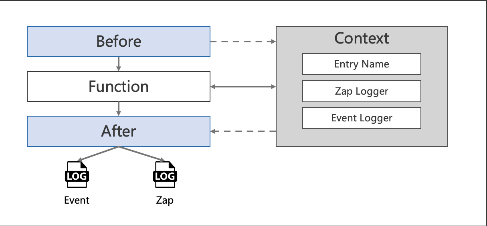

# Log interceptor
In this example, we will try to create GoFrame server with log interceptor enabled.

<!-- START doctoc generated TOC please keep comment here to allow auto update -->
<!-- DON'T EDIT THIS SECTION, INSTEAD RE-RUN doctoc TO UPDATE -->
**Table of Contents**  *generated with [DocToc](https://github.com/thlorenz/doctoc)*

- [Quick start](#quick-start)
  - [Code](#code)
- [Options](#options)
  - [Encoding](#encoding)
  - [OutputPath](#outputpath)
  - [Context Usage](#context-usage)
- [Example](#example)
    - [Start server](#start-server)
    - [Output](#output)
  - [Code](#code-1)

<!-- END doctoc generated TOC please keep comment here to allow auto update -->

## Quick start
Get rk-gf package from the remote repository.

```go
go get -u github.com/rookie-ninja/rk-gf
```

### Code
```go
import     "github.com/rookie-ninja/rk-gf/interceptor/log/zap"
```

```go
	interceptors := []ghttp.HandlerFunc{
        rkgflog.Interceptor(),
    }
```

## Options
Log interceptor will init rkquery.Event, zap.Logger and entryName which will be injected into request context before user function.
As soon as user function returns, interceptor will write the event into files.



| Name | Default | Description |
| ---- | ---- | ---- |
| WithEntryNameAndType(entryName, entryType string) | entryName=gf, entryType=gf | entryName and entryType will be used to distinguish options if there are multiple interceptors in single process. |
| WithZapLoggerEntry(zapLoggerEntry *rkentry.ZapLoggerEntry) | [rkentry.GlobalAppCtx.GetZapLoggerEntryDefault()](https://github.com/rookie-ninja/rk-entry/blob/master/entry/context.go) | Zap logger would print to stdout with console encoding type. |
| WithEventLoggerEntry(eventLoggerEntry *rkentry.EventLoggerEntry) | [rkentry.GlobalAppCtx.GetEventLoggerEntryDefault()](https://github.com/rookie-ninja/rk-entry/blob/master/entry/context.go) | Event logger would print to stdout with console encoding type. |
| WithZapLoggerEncoding(ec int) | rkgflog.ENCODING_CONSOLE | rkgflog.ENCODING_CONSOLE and rkgflog.ENCODING_JSON are available options. |
| WithZapLoggerOutputPaths(path ...string) | stdout | Both absolute path and relative path is acceptable. Current working directory would be used if path is relative. |
| WithEventLoggerEncoding(ec int) | rkgflog.ENCODING_CONSOLE | rkgflog.ENCODING_CONSOLE and rkgflog.ENCODING_JSON are available options. |
| WithEventLoggerOutputPaths(path ...string) | stdout | Both absolute path and relative path is acceptable. Current working directory would be used if path is relative. |

```go
    // ********************************************
    // ********** Enable interceptors *************
    // ********************************************
	interceptors := []ghttp.HandlerFunc{
		rkgflog.Interceptor(
		// Entry name and entry type will be used for distinguishing interceptors. Recommended.
		// rkgflog.WithEntryNameAndType("greeter", "gf"),
		//
		// Zap logger would be logged as JSON format.
		// rkgflog.WithZapLoggerEncoding(rkgflog.ENCODING_JSON),
		//
		// Event logger would be logged as JSON format.
		// rkgflog.WithEventLoggerEncoding(rkgflog.ENCODING_JSON),
		//
		// Zap logger would be logged to specified path.
		// rkgflog.WithZapLoggerOutputPaths("logs/server-zap.log"),
		//
		// Event logger would be logged to specified path.
		// rkgflog.WithEventLoggerOutputPaths("logs/server-event.log"),
		),
	}
```

### Encoding
- CONSOLE
No options needs to be provided. 
```shell script
2021-11-01T03:58:19.804+0800    INFO    log/greeter-server.go:81        Received request from client.
```

```shell script
------------------------------------------------------------------------
endTime=2021-11-01T03:58:19.804295+08:00
startTime=2021-11-01T03:58:19.804106+08:00
elapsedNano=189272
timezone=CST
ids={"eventId":"5f7ba3d7-6197-4ab7-86c8-f1fe5a3ea076"}
app={"appName":"rk","appVersion":"","entryName":"gf","entryType":"gf"}
env={"arch":"amd64","az":"*","domain":"*","hostname":"lark.local","localIP":"10.8.0.6","os":"darwin","realm":"*","region":"*"}
payloads={"apiMethod":"GET","apiPath":"/rk/v1/greeter","apiProtocol":"HTTP/1.1","apiQuery":"name=rk-dev","userAgent":"curl/7.64.1"}
error={}
counters={}
pairs={}
timing={}
remoteAddr=localhost:57247
operation=/rk/v1/greeter
resCode=200
eventStatus=Ended
EOE
```

- JSON
```go
    // ********************************************
    // ********** Enable interceptors *************
    // ********************************************
	interceptors := []ghttp.HandlerFunc{
        rkgflog.Interceptor(
            // Zap logger would be logged as JSON format.
            rkgflog.WithZapLoggerEncoding(rkgflog.ENCODING_JSON),
            //
            // Event logger would be logged as JSON format.
            rkgflog.WithEventLoggerEncoding(rkgflog.ENCODING_JSON),
        ),
    }
```
```json
{"level":"INFO","ts":"2021-11-01T03:59:30.840+0800","msg":"Received request from client."}
```
```json
{"endTime": "2021-11-01T03:59:30.841+0800", "startTime": "2021-11-01T03:59:30.840+0800", "elapsedNano": 163415, "timezone": "CST", "ids": {"eventId":"8f3fac34-f3bb-480b-981f-c13ab7bf5e30"}, "app": {"appName":"rk","appVersion":"","entryName":"gf","entryType":"gf"}, "env": {"arch":"amd64","az":"*","domain":"*","hostname":"lark.local","localIP":"10.8.0.6","os":"darwin","realm":"*","region":"*"}, "payloads": {"apiMethod":"GET","apiPath":"/rk/v1/greeter","apiProtocol":"HTTP/1.1","apiQuery":"name=rk-dev","userAgent":"curl/7.64.1"}, "error": {}, "counters": {}, "pairs": {}, "timing": {}, "remoteAddr": "localhost:61756", "operation": "/rk/v1/greeter", "eventStatus": "Ended", "resCode": "200"}
```

### OutputPath
- Stdout
No options needs to be provided. 

- Files
```go
    // ********************************************
    // ********** Enable interceptors *************
    // ********************************************
	interceptors := []ghttp.HandlerFunc{
        rkgflog.Interceptor(
            // Zap logger would be logged to specified path.
            rkgflog.WithZapLoggerOutputPaths("logs/server-zap.log"),
            //
            // Event logger would be logged to specified path.
            rkgflog.WithEventLoggerOutputPaths("logs/server-event.log"),
        ),
    }
```

### Context Usage
| Name | Functionality |
| ------ | ------ |
| rkgfctx.GetLogger(*ghttp.Request) | Get logger generated by log interceptor. If there are X-Request-Id or X-Trace-Id as headers in incoming and outgoing metadata, then loggers will has requestId and traceId attached by default. |
| rkgfctx.GetEvent(*ghttp.Request) | Get event generated by log interceptor. Event would be printed as soon as RPC finished. |
| rkgfctx.GetIncomingHeaders(*ghttp.Request) | Get incoming header. |
| rkgfctx.AddHeaderToClient(ctx, "k", "v") | Add k/v to headers which would be sent to client. This is append operation. |
| rkgfctx.SetHeaderToClient(ctx, "k", "v") | Set k/v to headers which would be sent to client. |

## Example
In this example, we enable log interceptor.

#### Start server
```shell script
$ go run greeter-server.go
```

#### Output
- Server side (zap & event)
```shell script
2021-11-01T03:58:19.804+0800    INFO    log/greeter-server.go:81        Received request from client.
```

```shell script
------------------------------------------------------------------------
endTime=2021-11-01T03:58:19.804295+08:00
startTime=2021-11-01T03:58:19.804106+08:00
elapsedNano=189272
timezone=CST
ids={"eventId":"5f7ba3d7-6197-4ab7-86c8-f1fe5a3ea076"}
app={"appName":"rk","appVersion":"","entryName":"gf","entryType":"gf"}
env={"arch":"amd64","az":"*","domain":"*","hostname":"lark.local","localIP":"10.8.0.6","os":"darwin","realm":"*","region":"*"}
payloads={"apiMethod":"GET","apiPath":"/rk/v1/greeter","apiProtocol":"HTTP/1.1","apiQuery":"name=rk-dev","userAgent":"curl/7.64.1"}
error={}
counters={}
pairs={}
timing={}
remoteAddr=localhost:57247
operation=/rk/v1/greeter
resCode=200
eventStatus=Ended
EOE
```

- Client side
```shell script
$ curl "localhost:8080/rk/v1/greeter?name=rk-dev"
{"Message":"Hello rk-dev!"}
```

### Code
- [greeter-server.go](greeter-server.go)
